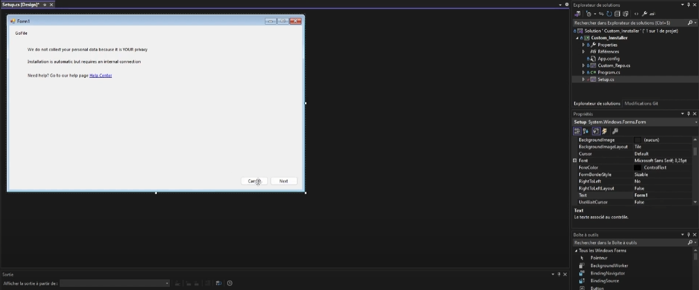

# Custom Installer


This project is aimed at providing a simple and customizable solution for creating your own software installer. Whether you're distributing your own application or bundling various tools together, this installer creator provides an easy-to-use interface.

## Features

- **Customizable Interface**: Tailor the installer interface to match your branding or application theme.
- **File Management**: Easily add, remove, or rearrange files and directories to be included in the installer.
- **License Agreement**: Include a license agreement that users must accept before proceeding with the installation.
- **Installation Options**: Allow users to customize installation options such as installation directory or components to install.
- **Support for Images**: Add images to various steps of the installation process for better user engagement.

## Installation

1. Clone this repository in your Visual Studio with C++
   ```
   git clone https://github.com/LegoshiiFR/Custom_Installer.git
   ```

2. It's all !


## Usage

1. Launch the code.

2. Customize the installer settings such as name, version, and output directory.

3. Add files and directories to be included in the installer.

4. Configure installation options and settings.

5. Optionally, add images to enhance the installation experience.

6. Generate the installer.

## Screenshots




---

Feel free to contribute, report issues, or suggest improvements! We appreciate your feedback. Happy installing! 🚀